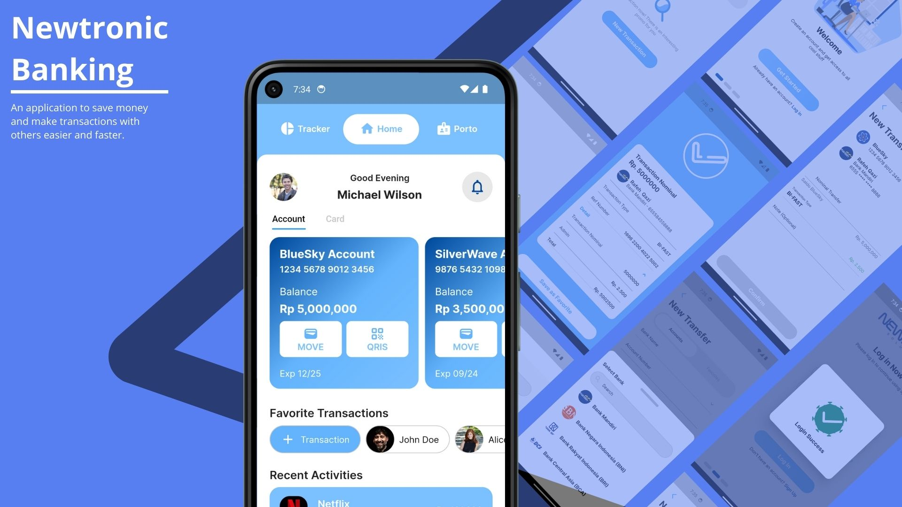

# NEWTRONIC BANKING

**Listyo Adi | Mobile Developer**

## Description
Newtronic Banking is a mobile application that allows you to manage your bank account and make transactions. This application is built using Flutter. This application is still in development stage. 

## Features

- [x] Authentication Screen
- [x] Home Screen
- [x] Transaction Screen
- [x] Add New Transaction Screen
- [x] Status Transaction Screen

## Requirements
- Flutter
- Android SDK
- Android Emulator / Android Device (Google Pixel 5)

## Installation
- Clone This Repository
- Run `flutter pub get`
- Run `flutter run`
- Login with this account
  - Email: `michael.wilson@newtronic.com` or `michaelwilson`
  - Password: `pass1234`
- Done

## Screenshot

  